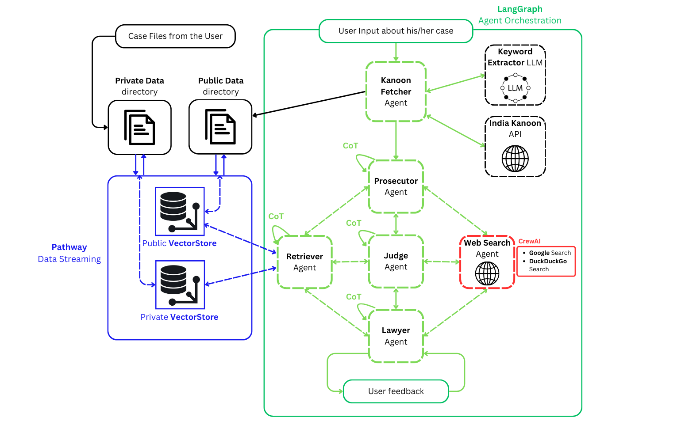

# PathRAG Court

_Full Project Report [here](./project_report.pdf)_
---

[](https://forthebadge.com)

### Running the project: 🚀

- Since Pathway is meant to be deployed in a containerized manner, and single-machine deployments can easily be achieved using Docker - we opted to make the whole app be able to run in a docker container. The dependencies are automatically installed into the container using the `requirements.txt` file.
- Therefore to run the project, you need to have **Docker** installed in your environment.
- First, go into the project directory, and setup a `.env` file (have to make the file) containing all the **API Keys** required to run the LLMs and fetching tools.:

```env
GOOGLE_API_KEY= <your_key_here>
GROQ_API_KEY= <your_key_here>
HUGGINGFACE_API_KEY= <your_key_here>
SERPER_API_KEY= <your_key_here>
KANOON_API_KEY= <your_key_here>
// Other API keys for any LLM you would like to use
```

- Then, run the following command:

```terminal
docker build -t pathwaytest .
```

`pathwaytest` can be replaced with any name you want to give to the image.
Then, run the container with the following command:

```terminal
docker run -it -p 8000:8000 --rm --env-file .env pathwaytest
```

_Use the same name as above_, this will expose the backend FastAPI server at port 8000.

---

### Architecture Diagram: 🏛️



### Problem Solved: 🎯

1. **Preparing for Legal Cases**

   - **Problem**: Preparing for a court case involves analyzing previous cases, predicting arguments, and anticipating the course of proceedings, which can be overwhelming.
   - **Solution**: By simulating court proceedings based on user-provided case descriptions and files, the system helps users practice and prepare for real-world legal scenarios, providing insights into potential arguments, counterarguments, and outcomes.

1. **Educational Tool for Legal Understanding**

   - **Problem**: Many individuals lack exposure to how courts operate, leading to confusion and anxiety about legal proceedings.
   - **Solution**: The system provides an educational platform where users can interactively learn about court processes, understand legal principles, and explore how different factors influence verdicts.

1. **Accessible Legal Expertise**
   - **Problem**: Access to professional legal expertise is often expensive and not always feasible for all individuals, especially for preliminary case evaluations.
   - **Solution**: By simulating courtroom interactions with intelligent agents, the application provides users with a preliminary understanding of their case, enabling informed decisions without immediate legal consultation.

## References

1. Indian Penal Code PDF: [link](https://www.iitk.ac.in/wc/data/IPC_186045.pdf)
1. PDF Parsing reference: [Multimodal RAG for PDFs with Text, Images, and Charts](https://pathway.com/developers/templates/multimodal-rag)
1. Vector store reference: [Data Indexing](https://pathway.com/developers/user-guide/llm-xpack/vectorstore_pipeline/)
